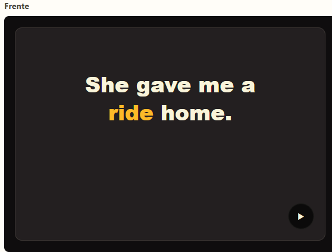
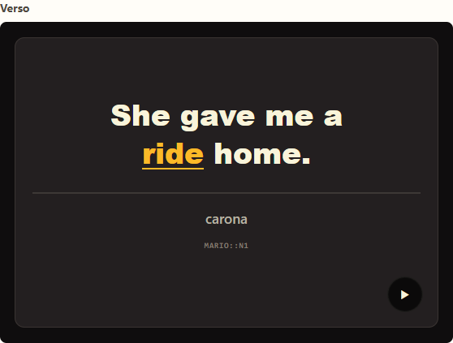
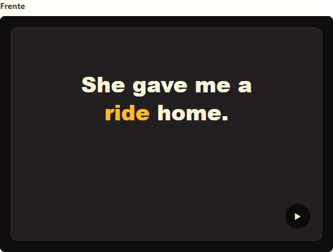
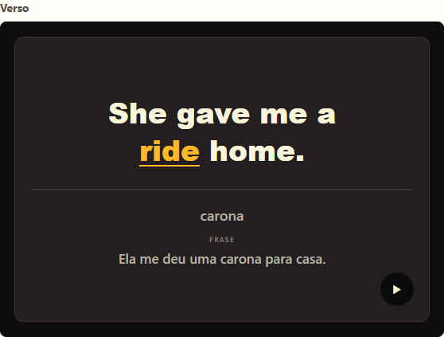

# Templates

Esta documentacao referencia os templates Anki mantidos neste repositorio.

Para uma pagina visual completa, abra [index.html](index.html).

## Templates disponiveis

| Template | Frente | Verso | Campos aceitos |
| --- | --- | --- | --- |
| [`basic-editorial-v1`](#basic-editorial-v1) |  |  | - `Frente` - `Verso` - `Audio` |
| [`basic-editorial-v2`](#basic-editorial-v2) |  |  | - `Frase em ingles` - `Traducao do trecho` - `Traducao da frase` - `Audio em ingles` - `Transcricao JSON` |

## `basic-editorial-v1`

Tipo de nota: `Mairo Clean - Basic Editorial v1`

Preview: [frente e verso](index.html#basic-editorial-v1)

### Campos aceitos

- `Frente`
- `Verso`
- `Audio`

### Arquivos

- `templates/basic-editorial-v1/front.template.html`
- `templates/basic-editorial-v1/back.template.html`
- `templates/basic-editorial-v1/styling.css`
- `templates/basic-editorial-v1/anki.model.json`

## `basic-editorial-v2`

Tipo de nota: `Mairo Clean - Basic Editorial v2`

Preview: [frente e verso](index.html#basic-editorial-v2)

### Campos aceitos

- `Frase em ingles`
- `Traducao do trecho`
- `Traducao da frase`
- `Audio em ingles`
- `Transcricao JSON`

### Arquivos

- `templates/basic-editorial-v2/front.template.html`
- `templates/basic-editorial-v2/back.template.html`
- `templates/basic-editorial-v2/styling.css`
- `templates/basic-editorial-v2/anki.model.json`

## Instalar

Veja [como-instalar.md](como-instalar.md) para instalar manualmente no Anki.
